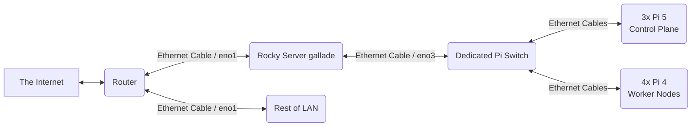

# K3s Cluster Setup Summary

## Project Goal: High Availability K3s Cluster on Raspberry Pis

This project aims to deploy and manage a HA K3s cluster using Raspberry Pis (3x Pi 5 as control plane/etcd, 4x Pi 4 as workers), managed primarily via GitOps with Argo CD. A Rocky Linux server (`gallade`) acts as a central network control point and external access gateway.

---

## Diagrams
### Physical Network

### Networking
graph LR
    A[The Internet] --> B(Router)
    B --> C(Rocky Server gallade 192.168.1.99/22 - eno1)
    C -- Internal LAN --> B
    C -- eno3 --> D(Dedicated Pi Switch)
    C -- br-pi (OVS Bridge) 192.168.4.1/24 --> D
    C -- Firewall/NAT --> A

    subgraph Raspberry Pi Cluster
        D -- 192.168.4.0/24 --> F(Pi Control Plane Nodes x3 192.168.4.11-.13)
        D -- 192.168.4.0/24 --> G(Pi Worker Nodes x4 192.168.4.14-.17)
        F --> H[K3s Cluster]
        G --> H
        J(Hosts High Level Applications and Services ) --> H
    end

    H -- K3s API (6443) --> C
    H -- Cilium Network --> D
    H -- Cilium LoadBalancer --> C
    C -- Forwards to K3s LoadBalancer --> H
    C -- Access via Router & Firewalld --> H

## I. Network Infrastructure (Rocky Server - `gallade`)

1.  **Interfaces:**
    * `eno1`: Connects to the main LAN (`192.168.0.0/22`), IP `192.168.1.99/22`.
    * `eno3`: Connects to a dedicated switch for the Raspberry Pi cluster.
2.  **Open vSwitch (OVS):**
    * Configured on `gallade` to manage the Pi network.
    * Bridge `br-pi` created, `eno3` added as a port.
    * Static IP `192.168.4.1/24` assigned to `br-pi`.
    * **Workaround:** NetworkManager had issues applying the static IP; a systemd service (`assign-br-pi-ip.service`) using `ip addr add` was created to assign the IP on boot.
3.  **DHCP Server (`dhcpd`):**
    * Runs on `gallade`, listening on `br-pi`.
    * Serves IPs to the Pi cluster in the `192.168.4.0/24` subnet.
    * Configured with static leases for Pis (`192.168.4.11`-.17).
    * Currently configured to provide public DNS (`1.1.1.1`) to clients.
4.  **Firewall (`firewalld`):**
    * `eno1` assigned to `public` zone.
    * `br-pi` assigned to `internal` zone.
    * NAT/Masquerading enabled for `public` zone.
    * **Workaround:** Standard masquerading wasn't applying correctly to `iptables`; a `--direct` rule (`ipv4 nat POSTROUTING 0 -s 192.168.4.0/24 -o eno1 -j MASQUERADE`) was added to force NAT for the Pi subnet.
    * An explicit policy (`internal_to_public`) with `target: ACCEPT` was needed to allow forwarding between zones.
5.  **HAProxy:**
    * Installed on `gallade` to provide HA access to the K3s API server.
    * Listens on `*:6443`.
    * Backends: `192.168.4.11:6443`, `192.168.4.12:6443`, `192.168.4.13:6443` (control-plane nodes) with TCP health checks.
    * **Troubleshooting:** Required SELinux policy adjustments (`semanage port` for 6443, `semanage fcontext`/`restorecon` for `/var/run/haproxy`, potentially `audit2allow`) to allow port binding and socket creation.

---

## II. K3s Cluster (Raspberry Pis)

1.  **Nodes:**
    * Control Plane/etcd: `arkveld` (11), `reydau` (12), `zohshia` (13) - Pi 5s with NVMe.
    * Workers: `rathalos` (14), `rathian` (15), `gravios` (16), `congalala` (17) - Pi 4s.
2.  **Installation:** Deployed using Axivo Ansible roles (cluster was recently reset/recreated).
3.  **Networking (CNI):** Cilium (v1.17.2 based on status output).
4.  **Core Components (via Axivo Roles):**
    * **Cilium:** CNI, Kube-proxy replacement, Network Policy, Ingress Controller, Gateway API implementation, Hubble.
    * **CoreDNS:** Internal cluster DNS.
    * **cert-manager:** Manages TLS certificates. Configured with Cloudflare ClusterIssuers (staging and production).
    * **ExternalDNS:** Manages external DNS records (Cloudflare).
    * **Longhorn:** Distributed block storage.
    * **Argo CD:** GitOps continuous delivery tool.
    * **VictoriaMetrics Stack:** Monitoring.
    * **Kured:** Node reboot coordination.
5.  **Configuration & Troubleshooting:**
    * **K3s Join:** Initial join failed due to DNS resolution failure for the first master node's hostname. **Workaround:** Modified `/etc/cloud/templates/hosts.debian.tmpl` on all nodes to include static host entries.
    * **API Server Access (Lens):** Required adding the HAProxy IP (`192.168.1.99`) to the `tls-san` configuration parameter on all K3s control-plane nodes and restarting them. Lens kubeconfig points to HAProxy (`https://192.168.1.99:6443`).
    * **External Access (Ingress/Gateway):**
        * Main router forwards ports 80/443 to `gallade` (`192.168.1.99`).
        * `firewalld` on `gallade` forwards 80/443 to the internal K3s LoadBalancer IP (provided by Cilium, e.g., `192.168.4.20`).
        * **NAT Loopback Issue:** Access from internal LAN failed. **Workaround:** Needs router NAT loopback setting enabled or hosts file overrides on internal clients.
    * **ExternalDNS:** Required `target` annotation on Ingress/Services to use the public IP. Also required `hostname` annotation on Services.
    * **TLS Certificates:**
        * Initially served weak/expired/staging certificates.
        * Problem traced to Cilium ingress controller **not loading the correct Secret** specified in `Ingress` or `Gateway` resources, despite RBAC permissions being correct and the Secret containing the valid production certificate.
        * Cluster reset performed. Issue might persist. Suspected underlying Cilium/API server instability or configuration issue preventing Envoy from loading TLS contexts correctly. Cilium Operator logs showed API server communication errors and CEC update conflicts.
    * **Longhorn Storage:**
        * Initial dynamic provisioning issue (required manual volume creation) - resolved after cluster reset.
        * Data locality issue (replicas on non-NVMe nodes). **Solution:** Applied node labels (`storage-type=nvme`) and `nodeAffinity` to Deployments requiring NVMe storage. Ensured `volumeBindingMode: WaitForFirstConsumer` on StorageClass.
        * Volume mounting issue (`volumeDevices` vs `volumeMounts`) - corrected in Deployment template.

---

## III. GitOps / Argo CD

1.  **Goal:** Manage cluster configuration declaratively via Git.
2.  **App of Apps Pattern:** Implemented using a parent Helm chart (`apps/`) in Git that templates Argo CD `Application` resources.
3.  **Application Chart Template:** Created a reusable Helm chart (`charts/my-simple-app/`) to deploy multiple simple applications with configurable images, replicas, environment variables, and volumes.
4.  **Troubleshooting:**
    * Resolved `app not allowed in project` error by fixing AppProject source repo permissions.
    * Resolved Helm template errors (`nil pointer`, literal template strings) by fixing `values.yaml` structure and ensuring the root Argo CD app used `helm.valueFiles`.
    * Resolved `OutOfSync` issue for Namespaces by adding `ignoreDifferences` for Argo CD labels to the Application spec template.

---

## Current Status:

* Cluster was recently reset and redeployed via Ansible.
* HAProxy provides HA access to the K3s API.
* Lens can connect via HAProxy.
* Basic network connectivity and NAT for egress traffic from Pis seem functional.
* **Outstanding Major Issue:** Verifying if the persistent problem with Cilium ingress serving the wrong TLS certificate (despite correct Secret/RBAC/Gateway config) is resolved after the cluster reset.
* **Next Steps (Implied):** Test external access to services (like Argo CD) again, verify TLS certificates, continue configuring applications via the Argo CD App of Apps structure.

